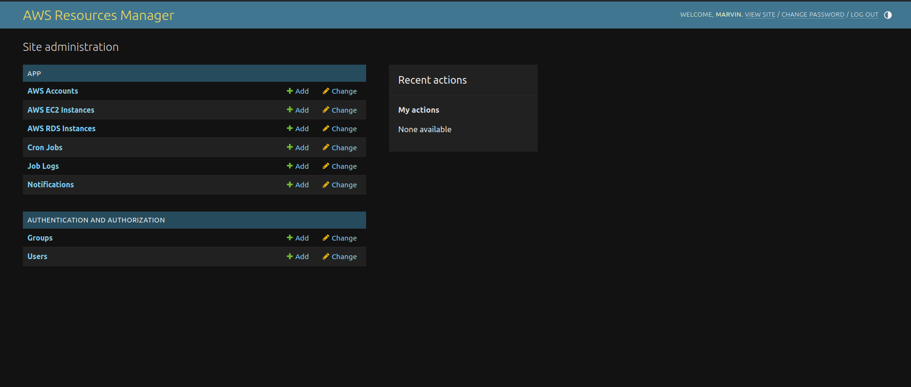
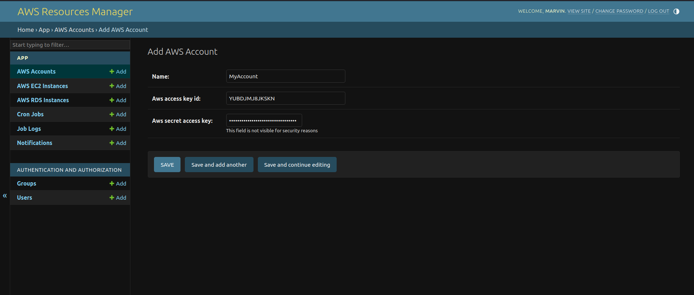
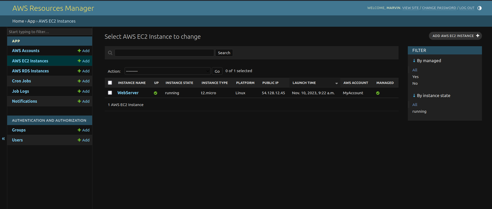
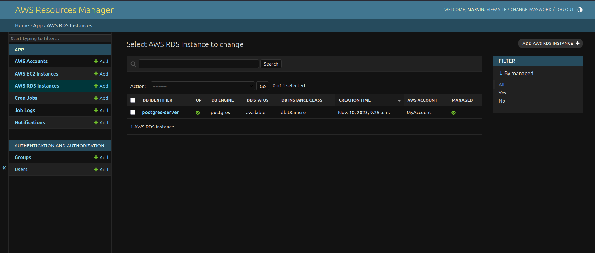
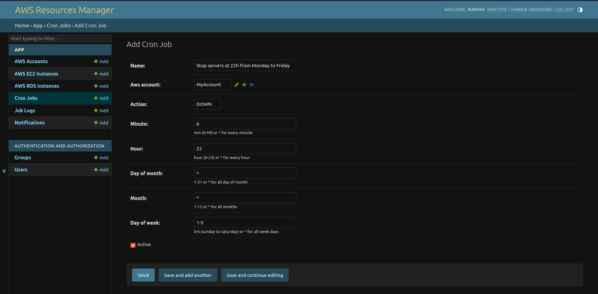
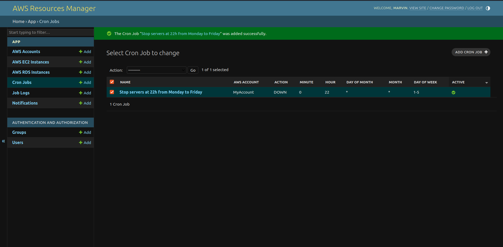
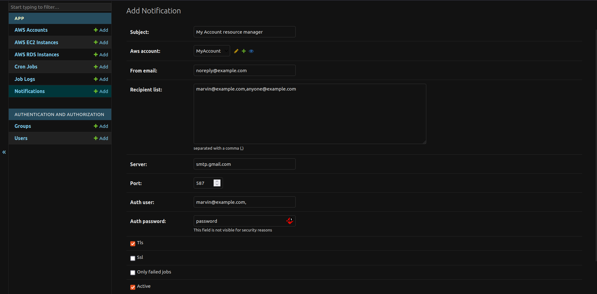

# AWS Resource Manager

- Manage your aws resources from simple UI on your local machine or remote server
- Setup cronjobs to stop and start EC2 and RDS instances
- Reduce EC2 and RDS usage cost

# Prerequisites

- [Docker](https://docs.docker.com/get-docker/)
- [docker-compose](https://docs.docker.com/compose/install/)

### Clone the repository on your computer:

Clone repo and generate local configuration files:
```
git clone https://github.com/marvincorreia/aws_resource_manager.git
cd aws_resource_manager
cp .env.example .env
```
Review and configure the environment [.env](.env) file

```
# Database connection (required)
DB_NAME=aws_management
DB_USER=aws_management
DB_PASSWORD=my_db_password
DB_HOST=postgres
DB_PORT=5432

# Dont use debug set to true in production environment
# default to false
DEBUG=true

# Not required, if not set one will be generated randomly
SECRET_KEY=secret_key_here

# Not required if using valid ssl certificate (CSRF_TRUSTED_ORIGINS)
# separeted with comma
ALLOWED_ORIGINS=https://localhost,https://192.168.1.10

# Not required, by default is set to root user
CRONTAB_USER=root
```

## Run the docker-compose file [docker-compose.final.yml](docker-compose.final.yml)

```sh
docker-compose -f docker-compose.final.yml up -d
``` 

```yml
version: "3.7"

services:
  aws-resource-manager:
    image: marvincorreia/aws-resource-manager:1.0.0-alpine
    environment:
      - DEBUG=$DEBUG
      - DB_NAME=$DB_NAME
      - DB_USER=$DB_USER
      - DB_PASSWORD=$DB_PASSWORD
      - DB_HOST=$DB_HOST
      - DB_PORT=$DB_PORT
      - SECRET_KEY=$SECRET_KEY
    ports:
      - 8000:8000
    restart: unless-stopped
    depends_on:
      - postgres

  postgres:
    image: postgres:14
    volumes:
      - pgdata:/var/lib/postgresql/data
    environment:
      - POSTGRES_DB=$DB_NAME
      - POSTGRES_USER=$DB_USER
      - POSTGRES_PASSWORD=$DB_PASSWORD
    restart: unless-stopped


volumes:
  pgdata:
```
The app will be available on http://localhost:8000

## Generate superuser
```sh
docker-compose exec -e DJANGO_SUPERUSER_PASSWORD="my_strong_pass" aws-resource-manager python manage.py createsuperuser --username=admin --no-input
```

# User Interface


# Add AWS Accounts


# EC2 Instances


# RDS Instances


# Add Cronjobs



# Add Notification



